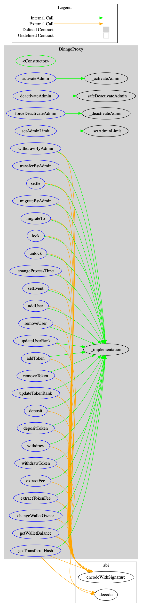
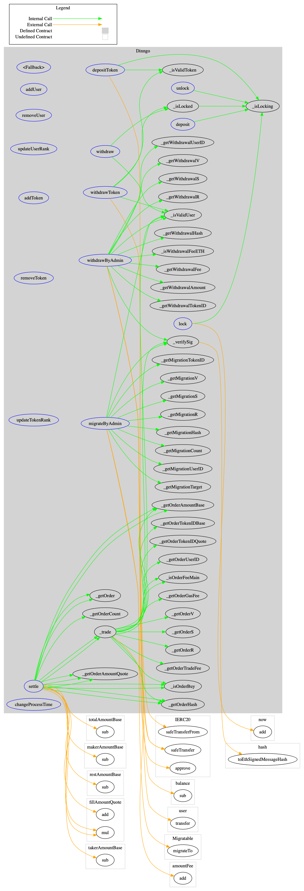
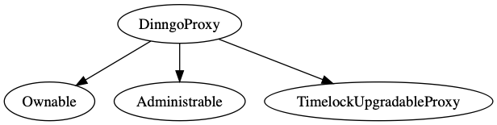
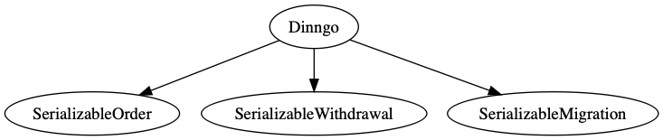

# <a id="heading-0"/> Section 1 - Table of Contents 

* 1 - [Table of Contents](#heading-0)
* 2 - [Introduction](#heading-2)
    * 2.1 - [Analysis Goals and Focus](#heading-2.1)
        * 2.1.1 - [Sound Architecture](#heading-2.1.1)
        * 2.1.2 - [Smart Contract Best Practices](#heading-2.1.2)
        * 2.1.3 - [Code Correctness](#heading-2.1.3)
        * 2.1.4 - [Code Quality](#heading-2.1.4)
        * 2.1.5 - [Security](#heading-2.1.5)
        * 2.1.6 - [Testing and testability](#heading-2.1.6)
    * 2.2 - [About Dinngo](#heading-2.2)
* 3 - [Overview](#heading-3)
    * 3.1 - [Source Code](#heading-3.1)
    * 3.2 - [General Notes](#heading-3.2)
    	 * 3.2.1 - [Surya](#heading-3.2.1)
    	 * 3.2.2 - [Solhint](#heading-3.2.2)
    	 * 3.2.3 - [Mythril-classic](#heading-3.2.3)
    	 * 3.2.4 - [Oyente](#heading-3.2.4)
    	 * 3.2.5 - [Manticore](#heading-3.2.5)
    * 3.3 - [Contracts](#heading-3.3)
* 4 - [Analysis findings](#heading-4)
    * 4.1 - [Contract control flow](#heading-4.1)
    	 * 4.1.1 - [DinngoProxy](#heading-4.1.1)
    	 * 4.1.2 - [Dinngo](#heading-4.1.2)
    * 4.2 - [Contract inheritance](#heading-4.2)
    	 * 4.2.1 - [DinngoProxy](#heading-4.2.1)
    	 * 4.2.2 - [Dinngo](#heading-4.2.2)
    * 4.3 - [Smart Contract Weakness Classification](#heading-4.3)
* 5 - [Summary](#heading-5)

# <a id="heading-2"/> Section 2 - Introduction

This analysis report reveals the structure and provides practical assurance of the logic and implementation of the contracts.

## <a id="heading-2.1"/> 2.1 Analysis Goals and Focus

### <a id="heading-2.1.1"/> 2.1.1 Sound Architecture

This report includes an overall architecture and design analysis.


### <a id="heading-2.1.2"/> 2.1.2 Smart Contract Best Practices

This report will evaluate whether the codebase follows the current established best practices for smart contract development.


### <a id="heading-2.1.3"/> 2.1.3 Code Correctness

This report will evaluate whether the code does what it is intended to do.


### <a id="heading-2.1.4"/> 2.1.4 Code Quality

This report will evaluate whether the code has been written in a way that ensures readability and maintainability.


### <a id="heading-2.1.5"/> 2.1.5 Security

This report will look for any exploitable security vulnerabilities, or other potential threats to either the operators of Dinngo or its users.


### <a id="heading-2.1.6"/> 2.1.6 Testing and testability

This report will examine how easily tested the code is, and review how thoroughly tested the code is.


## <a id="heading-2.2"/> 2.2 About Dinngo

Dinngo is a hybrid-based exchange, which enables a single party to place order and match with another. Dinngo does not keep any information about user private key to achieve the trading. The entire settlement is performed by the smart contract which is triggered by Dinngo, while users reserve control of their own asset.

# <a id="heading-3"/> Section 3 - Overview

## <a id="heading-3.1"/> 3.1 Source Code

The Dinngo smart contract source code was made available in the [dinngo-exchange/contracts](https://github.com/Dinngo/dinngo-exchange) Github repository. The code was analyzed as of commit `66280ccc56f6eaceda65c7867ab60fb738e7f12c`.

The following Solidity source files (with SHA1 sums) were audited:

```
SHA1(dinngo-exchange/contracts/Administrable.sol)=
d1cdf8a2e34d3ff5703c32051dd5280cc4026f49
SHA1(dinngo-exchange/contracts/Dinngo.sol)=
eec53ad5a4981311d76eec916c5278eddfc19692
SHA1(dinngo-exchange/contracts/DinnogProxy.sol)=
00af77375d760f1ec748530ee185990bb605bbe6
SHA1(dinngo-exchange/contracts/SerializableOrder.sol)=
91afbf55118cfa1bf2a3d0820d7f050b4c8a6b50
SHA1(dinngo-exchange/contracts/SerializableWithdrawal.sol)=
3ea52a930635fa8e02aedec0090efba5a3424a24
SHA1(dinngo-exchange/contracts/ec/ErrorHandler.sol)=
7df1665ca922e1f46e76a6cbe14e5efc2aee2fea
SHA1(dinngo-exchange/contracts/proxy/Proxy.sol)=
0a88d06d413812412f80e610c4dc6f9f69f38a45
SHA1(dinngo-exchange/contracts/proxy/TimelockUpgradable.sol)=
67e12fb565ee8931220c54a6a67b99b58eb36589
```

Source codes in `contracts/mocks`, `contracts/examples`, and `contracts/Migrations.sol` were NOT analyzed.

## <a id="heading-3.2"> 3.2 Analysis Tools

### <a id="heading-3.2.1"> 3.2.1 Surya
Surya is an utility tool for smart contract systems, offering a number of visual outputs and information about the contracts' structure. Also supports querying the function call graph.

### <a id="heading-3.2.2"> 3.2.2 Solhint
Linters improve code quality by enforcing rules for style and composition, making code easier to read and review. Solhint is a linter for Solidity that provides both Security and Style Guide validations.

### <a id="heading-3.2.3"> 3.2.3 Mythril-classic
Mythril-classic is a powerful tool that combines multiple verification functions. It uses symbolic analysis, taint analysis and control flow checking to detect a variety of security vulnerabilities.

### <a id="heading-3.2.4"> 3.2.4 Oyente
Oyente is an analysis tool that finds common vulnerabilities of Ethereum contracts. It is able to detect *callstack attack*, *timestamp dependence attack*, *reentrancy bug*, *concurrency bug*, *assertion fails* and other tests.

### <a id="heading-3.2.5"> 3.2.5 Manticore
Manticore is a symbolic execution tool for analysis of smart contracts and binaries. It performs dynamic binary analysis tool with EVM support. By going through different sections of code with a variety of attack scenarios. 


## <a id="heading-3.3"/> 3.3 Contracts

`SafeMath` and `Byteslib `provides basic utility functionality used throughout the code. 

`Ownable` provides a owner role to ensure the authority of specific functions. `Administrable` provides an additional role in contract which is similar to owner. 

`Proxy` provides a proxy interface that enables the function call can be performed by the behaviour defined in an implementation contract. `TimelockUpgradableProxy` gives an extra constraint on upgrading time to garantee the fairness.

`ErrorHandler` enables the proxy contract to handle the status code that is returned by the execution result of implementation contract. Reverting will be triggered from proxy contract.

`SerializableOrder` and `SerializableWithdrawal` define the order and withdrawal handler by specifying the location within a `bytes` variable.

`DinngoProxy` defines a proxy contract that enables a delegate structure to upgrade the exchange contract by switching the implementation contract. Upgrading the contract requires a certain announcement period. New implementation can only be activated manually after that.

`Dinngo` defines the execution logic that is corresponding to `DinngoProxy`. The core functionality including the user/token management, user balance management and trading settlement are implemented.


# <a id="heading-4"/> 4 - Analysis findings

The tests are generally well written and complete, covering both happy paths and a wide range of exceptions and edge cases. Tests are easy to read and follow. Project building and testing can be easily performed through npm scripts.

## <a id="heading-4.1"/> 4.1 Contract control flow
Dinngo exchange is combined by two contracts, `DinngoProxy` and `Dinngo`. `DinngoProxy` is the proxy contract, which holds the data and authority management. `Dinngo` is the implementation contract, which defines the execution logic. 

### <a id="heading-4.1.1"/> 4.2.1 DinngoProxy


### <a id="heading-4.1.2"/> 4.1.2 Dinngo


## <a id="heading-4.2"/> 4.2 Contract inheritance

### <a id="heading-4.2.1"/> 4.2.1 DinngoProxy
`DinngoProxy` inheritates `Ownable`, `Administrable` and `TimelockUpgradableProxy` to manage the authority and upgradibility.





### <a id="heading-4.2.2"/> 4.2.2 Dinngo
`Dinngo` inheritates `SerializableOrder` and `SerializableWithdrawal` to handle the serialized data structure. `Ownable` and `Administrable` are for storage alignment with proxy contract.



## <a id="heading-4.3"/> 4.3 Smart Contract Weakness Classification
Except static and dynamic tests performed by [Mythril-classic](#heading-3.2.3), [Oyente](#heading-3.2.4) and [Manticore](#heading-3.2.5), the entire project is well reviewed through [Smart Contract Weakness Classification](https://smartcontractsecurity.github.io/SWC-registry/). The contract contents are free from the listed issues.

# <a id="heading-5"> 5 - Summary
In conclusion, Dinngo proposed a reliable structure to guarantee user's control of personal asset, while providing other important elements at the same time, such as comfortable trading experience and meeting the compliance needs. Also, the code is revised and free from the known issues discovered from the verifications above.

# <a id="heading-d"> Disclaimer
*This analysis is not a security warranty nor does it provide a security guarantee of the smart contracts. DINNGO Pte. Ltd. disclaims any liability for damage arising out of, or in connection with, this analysis. Copyright of this analysis remains with DINNGO Pte. Ltd.*